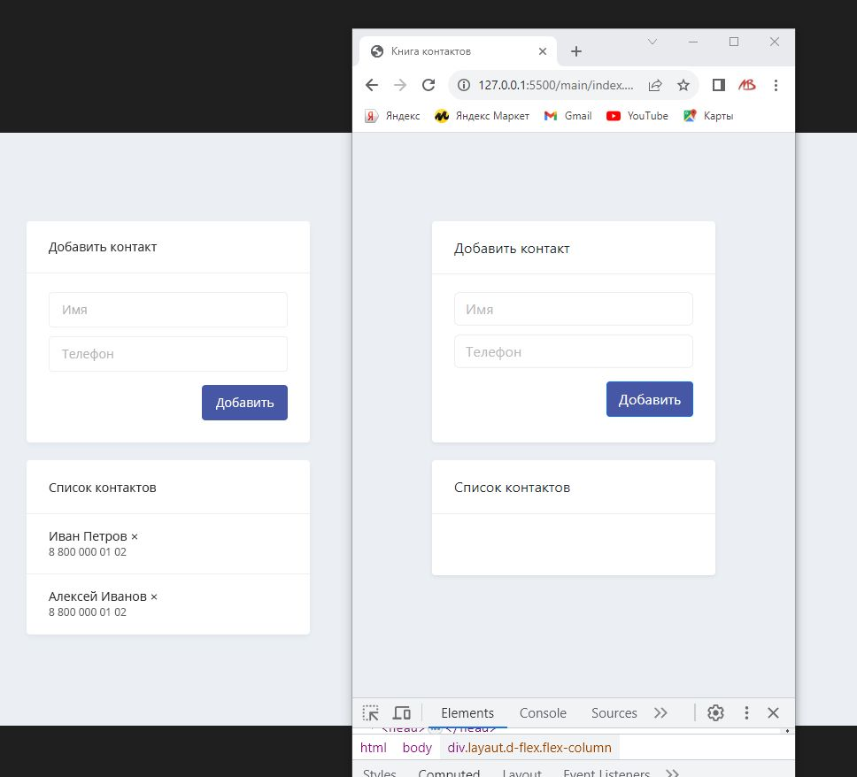

## Демо-проект на должность «PHP разработчик» в компанию ТГ «Alterra»

### Суть задачи:
Реализовать книгу контактов.

[//]: # (![]&#40;public/img/maket.png&#41;)

*Слева картинка из ТЗ, справа - вёрстка (клик - посмотреть демо)*
 
### Для разработки использовал:
1. PHP 8.0.12
2. Laravel 10
3. Bootstrap 5.3.0
4. JavaScript + jQuery 3.7.0
5. MySQL 8.0.27
6. WEB-сервер Apache 2.4 (локально)
7. Среда разработки PhpStorm 2023.1.4
8. Git 2.41.0

### Чтобы запустить проект локально, необходимо:
1. Клонировать проект в WEB-папку (localhost). Для этого выполнить команду: **git clone https://github.com/basile-malinine/alterra.loc.git**
2. В папке приложения выполнить соманду: **composer update**
3. На WEB-сервере произвести соответствующие настройки для папки **alterra.loc/**
4. В адресной строке браузера ввести: http://alterra.loc
5. Загрузится страница с подробным описанием задачи, а также с инструкцией по настройками MySQL-сервера для этого проекта
   
- **Василий Малинин**
- **Тел:** +7 916 114-5109 (Tg, WA)
- **Tg:** @BMalina
- **Почта:** basile-m@yandex.ru
